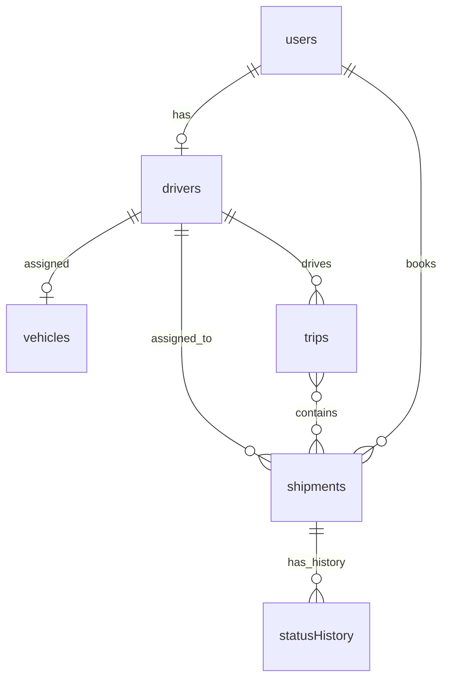

# AI-Driven Logistics, Fleet & Delivery Tracking System

> **P08 — Full-Stack Academic Project**
> Node.js · Express.js · MongoDB · Mongoose · JWT · Bootstrap

---

## 1. Project Title

**AI-Driven Logistics, Fleet & Delivery Tracking System**

> Note: Despite the title, this implementation focuses strictly on logistics management. No AI/ML features are included in this version.

---

## 2. Problem Statement

Modern logistics companies manage hundreds of vehicles, drivers, and shipments simultaneously. Manual coordination leads to delays, lost shipments, and poor fleet utilization. This system provides a unified digital platform for:

- Customers to book and track shipments
- Dispatchers to assign drivers and vehicles
- Drivers to update shipment statuses
- Admins to monitor fleet utilization

---

## 3. Objectives

1. Provide secure role-based access for Customers, Drivers, Dispatchers, and Admins
2. Automate the end-to-end shipment lifecycle from booking to delivery
3. Enforce a strict status transition workflow (BOOKED → ASSIGNED → PICKED_UP → IN_TRANSIT → DELIVERED)
4. Track every status change in an audit history
5. Report fleet utilization using MongoDB aggregation
6. Implement deterministic distance+weight-based pricing
7. Provide delivery proof for completed shipments

---

## 4. Features / Modules

| Module | Description |
|--------|-------------|
| 1. User Auth | Registration, login, JWT, bcrypt |
| 2. Vehicle Fleet | CRUD for trucks/vans, status management |
| 3. Driver Profiles | Link drivers to users and vehicles |
| 4. Shipment Booking | Customer creates shipment with auto-pricing |
| 5. Dispatch Assignment | Assign driver + vehicle with all validations |
| 6. Status Workflow | Enforced state machine for shipment lifecycle |
| 7. Status Update APIs | Driver updates status with location/notes |
| 8. Delivery Proof | Receiver name and confirmation note |
| 9. Trip Grouping | Group multiple shipments into a single trip |
| 10. Customer Tracking | Customers track their own shipment + history |
| 11. Fleet Reports | Aggregation-based utilization report |
| 12. Pricing Engine | Deterministic slab-based cost calculation |
| 13. RBAC | Role-based access middleware on every endpoint |

---

## 5. Technology Stack

| Layer | Technology |
|-------|-----------|
| Runtime | Node.js |
| Web Framework | Express.js 4.x |
| Database | MongoDB 7.x |
| ODM | Mongoose 8.x |
| Authentication | JWT (jsonwebtoken) |
| Password Hashing | bcryptjs |
| Validation | Joi |
| Frontend | HTML5, Bootstrap 5, Vanilla JavaScript |
| API Testing | Postman |

---

## 6. Architecture

MVC (Model-View-Controller) pattern:

```
Browser (Bootstrap SPA)
       ↓ HTTP fetch()
Express.js Server (server.js)
       ↓
Routes → Middleware (auth, validate, errorHandler)
       ↓
Controllers (business logic)
       ↓
Models (Mongoose schemas)
       ↓
MongoDB
```

---

## 7. Folder Structure

```
logistics-fleet-system/
├── config/
│   └── db.js                    # MongoDB connection
├── models/
│   ├── User.js                  # User schema (CUSTOMER/DRIVER/DISPATCHER/ADMIN)
│   ├── Vehicle.js               # Vehicle fleet schema
│   ├── Driver.js                # Driver profile schema
│   ├── Shipment.js              # Shipment schema with status workflow
│   ├── StatusHistory.js         # Audit log for status changes
│   └── Trip.js                  # Trip grouping schema
├── routes/
│   ├── authRoutes.js
│   ├── vehicleRoutes.js
│   ├── driverRoutes.js
│   ├── shipmentRoutes.js
│   ├── tripRoutes.js
│   ├── reportRoutes.js
│   └── pricingRoutes.js
├── controllers/
│   ├── authController.js
│   ├── vehicleController.js
│   ├── driverController.js
│   ├── shipmentController.js
│   ├── tripController.js
│   ├── reportController.js
│   └── pricingController.js
├── middleware/
│   ├── auth.js                  # authenticateToken + authorizeRoles
│   ├── validate.js              # Joi validation factory
│   └── errorHandler.js         # Centralized error handler
├── utils/
│   ├── token.js                 # JWT generate/verify
│   └── pricing.js              # Slab-based pricing engine
├── validators/
│   ├── authValidator.js
│   ├── vehicleValidator.js
│   ├── driverValidator.js
│   └── shipmentValidator.js
├── public/
│   ├── index.html               # Bootstrap 5 SPA
│   ├── css/style.css
│   └── js/app.js
├── postman/
│   └── Logistics_Fleet_API.postman_collection.json
├── seed.js                      # Demo data seeder
├── server.js                    # Application entry point
├── .env.example
├── .gitignore
└── README.md
```

---

## 8. MongoDB Collections

### `users`
| Field | Type | Notes |
|-------|------|-------|
| name | String | required |
| email | String | unique index |
| passwordHash | String | bcrypt, never returned in responses |
| role | Enum | CUSTOMER, DRIVER, DISPATCHER, ADMIN |
| createdAt, updatedAt | Date | auto |

### `vehicles`
| Field | Type | Notes |
|-------|------|-------|
| type | String | TRUCK, VAN, BIKE, MINI_TRUCK |
| capacity | Number | kg |
| status | Enum | AVAILABLE, ASSIGNED, INACTIVE |
| currentDriverId | ObjectId → Driver | indexed |
| createdAt, updatedAt | Date | auto |

### `drivers`
| Field | Type | Notes |
|-------|------|-------|
| userId | ObjectId → User | unique index |
| vehicleId | ObjectId → Vehicle | nullable |
| isAvailable | Boolean | true = free for assignment |
| licenseNumber | String | |
| phone | String | |

### `shipments`
| Field | Type | Notes |
|-------|------|-------|
| customerId | ObjectId → User | indexed |
| pickupAddress | String | required |
| dropAddress | String | required |
| status | Enum | BOOKED…DELIVERED/FAILED |
| assignedDriverId | ObjectId → Driver | indexed |
| assignedVehicleId | ObjectId → Vehicle | |
| cost | Number | auto-calculated |
| weight | Number | kg, required |
| distance | Number | km, required |
| shipmentType | Enum | STANDARD, EXPRESS, FRAGILE, BULK |
| deliveryProof | Embedded | receiverName, note, timestamp |

### `statusHistory`
| Field | Type | Notes |
|-------|------|-------|
| shipmentId | ObjectId → Shipment | indexed |
| status | Enum | mirrors shipment status |
| timestamp | Date | server-generated |
| note | String | optional |
| locationText | String | optional |
| updatedBy | ObjectId → User | |

### `trips`
| Field | Type | Notes |
|-------|------|-------|
| driverId | ObjectId → Driver | indexed |
| shipmentIds | [ObjectId → Shipment] | array |
| date | Date | required |
| notes | String | optional |

---

## 9. Database Relationships

MongoDB uses **references (ObjectIds)** rather than embedding because:
- Documents are separately queryable
- Avoiding large nested documents
- Supporting partial updates without re-writing entire documents
- Joins done at query time using `.populate()` (Mongoose)



---

## 10. Setup Instructions

### Prerequisites
- Node.js 18+
- MongoDB 7.x (running locally)

### Steps

```bash
# 1. Clone or navigate to project
cd logistics-fleet-system

# 2. Install dependencies
npm install

# 3. Configure environment
cp .env.example .env
# Edit .env — set your MONGODB_URI and JWT_SECRET

# 4. Start MongoDB (if not already running)
sudo systemctl start mongod
# OR
mongod --dbpath /data/db &

# 5. Seed demo data
node seed.js

# 6. Start the server
npm start
# OR with auto-reload:
npm run dev

# 7. Open browser
http://localhost:5000
```

---

## 11. Environment Variables

```env
PORT=5000
MONGODB_URI=mongodb://localhost:27017/logistics_fleet
JWT_SECRET=your_super_secret_jwt_key_change_in_production
JWT_EXPIRES_IN=7d
BCRYPT_ROUNDS=10
```

> ⚠️ Never commit the real `.env` file. Only `.env.example` is committed.

---

## 12. How to Start Backend

```bash
# Development (with nodemon auto-reload)
npm run dev

# Production
npm start
```

Server starts at `http://localhost:5000`

---

## 13. How to Start Frontend

The frontend is served automatically by the Express server as static files from the `/public` directory. Navigate to:

```
http://localhost:5000
```

No separate build step needed — it's a Bootstrap 5 SPA with vanilla JavaScript.

---

## 14. API Endpoint Table

### AUTH
| Method | Endpoint | Auth | Role | Description |
|--------|----------|------|------|-------------|
| POST | `/api/auth/register` | No | — | Register Customer or Driver |
| POST | `/api/auth/login` | No | — | Login, returns JWT |
| GET | `/api/auth/me` | Yes | Any | Get current user profile |

### VEHICLES
| Method | Endpoint | Auth | Role | Description |
|--------|----------|------|------|-------------|
| POST | `/api/vehicles` | Yes | ADMIN, DISPATCHER | Create vehicle |
| GET | `/api/vehicles` | Yes | ADMIN, DISPATCHER | List all vehicles |
| GET | `/api/vehicles/:id` | Yes | ADMIN, DISPATCHER | Get vehicle |
| PUT | `/api/vehicles/:id` | Yes | ADMIN, DISPATCHER | Update vehicle |
| DELETE | `/api/vehicles/:id` | Yes | ADMIN, DISPATCHER | Deactivate vehicle |

### DRIVERS
| Method | Endpoint | Auth | Role | Description |
|--------|----------|------|------|-------------|
| POST | `/api/drivers` | Yes | ADMIN, DISPATCHER | Create driver profile |
| GET | `/api/drivers` | Yes | ADMIN, DISPATCHER | List all drivers |
| GET | `/api/drivers/me` | Yes | DRIVER | Get own profile |
| GET | `/api/drivers/:id` | Yes | ADMIN, DISPATCHER, DRIVER | Get driver by ID |
| PUT | `/api/drivers/:id` | Yes | ADMIN, DISPATCHER | Update driver |

### SHIPMENTS
| Method | Endpoint | Auth | Role | Description |
|--------|----------|------|------|-------------|
| POST | `/api/shipments` | Yes | CUSTOMER | Create shipment |
| GET | `/api/shipments` | Yes | All | List (filtered by role) |
| GET | `/api/shipments/:id` | Yes | All | Get shipment (ownership enforced) |
| PUT | `/api/shipments/:id/assign` | Yes | ADMIN, DISPATCHER | Assign driver + vehicle |
| PUT | `/api/shipments/:id/status` | Yes | DRIVER, ADMIN, DISPATCHER | Update status |
| GET | `/api/shipments/:id/track` | Yes | CUSTOMER, ADMIN, DISPATCHER | Track shipment |
| POST | `/api/shipments/:id/delivery-proof` | Yes | DRIVER, ADMIN, DISPATCHER | Add delivery proof |

### TRIPS
| Method | Endpoint | Auth | Role | Description |
|--------|----------|------|------|-------------|
| POST | `/api/trips` | Yes | ADMIN, DISPATCHER | Create trip |
| GET | `/api/trips` | Yes | ADMIN, DISPATCHER, DRIVER | List trips |
| GET | `/api/trips/:id` | Yes | ADMIN, DISPATCHER, DRIVER | Get trip |
| PUT | `/api/trips/:id` | Yes | ADMIN, DISPATCHER | Update trip |

### REPORTS
| Method | Endpoint | Auth | Role | Description |
|--------|----------|------|------|-------------|
| GET | `/api/admin/reports/fleet-utilization` | Yes | ADMIN, DISPATCHER | Fleet utilization report |

### PRICING
| Method | Endpoint | Auth | Role | Description |
|--------|----------|------|------|-------------|
| POST | `/api/pricing/estimate` | Yes | Any | Get cost estimate |

---

## 15. Authentication

- JWT tokens are issued on login/register
- Token payload: `{ id: userId, role: 'CUSTOMER' | 'DRIVER' | 'DISPATCHER' | 'ADMIN' }`
- Token is sent in the `Authorization: Bearer <token>` header
- Tokens expire after 7 days (configurable)
- Passwords are hashed with bcrypt (10 rounds) and **never** appear in API responses (Mongoose `select: false`)

---

## 16. RBAC (Role-Based Access Control)

Two reusable middleware functions in `middleware/auth.js`:

```javascript
authenticateToken()   // validates JWT, attaches req.user
authorizeRoles(...roles)  // checks req.user.role
```

| Role | Can Do |
|------|--------|
| CUSTOMER | Register, login, create shipments, view own shipments, track |
| DRIVER | View own profile, view assigned shipments, update status, add proof |
| DISPATCHER | All Admin capabilities |
| ADMIN | Full system access including fleet management, reports |

Unauthorized access returns:
- `401` — missing or invalid JWT
- `403` — valid JWT but insufficient role

---

## 17. Shipment Status Workflow

```
BOOKED → ASSIGNED → PICKED_UP → IN_TRANSIT → DELIVERED
                ↘                  ↘             ↘
                 FAILED            FAILED         (terminal)
```

Every transition is validated server-side. Invalid transitions (e.g., BOOKED → DELIVERED) return `409 INVALID_STATUS_TRANSITION`.

Every successful transition creates a `StatusHistory` record with:
- shipmentId
- new status
- server timestamp
- optional note and locationText
- updatedBy (userId)

---

## 18. Business Rules

1. Driver must have `DRIVER` role before a driver profile is created
2. Vehicle must be `AVAILABLE` to be assigned
3. Driver must have `isAvailable: true` to be assigned
4. Vehicle capacity must be ≥ shipment weight for assignment
5. Customer can only view/track their own shipments
6. Driver can only update status of shipments assigned to them
7. Delivery proof can only be added when shipment is `DELIVERED`
8. When shipment reaches `DELIVERED` or `FAILED`, driver becomes available again and vehicle becomes `AVAILABLE`
9. Deactivating an `ASSIGNED` vehicle is blocked
10. Only one driver profile per user (unique userId)
11. Trip shipments must be assigned to the same driver

---

## 19. Pricing Logic

**Deterministic slab-based pricing:**

```
Cost = Base Rate + Distance Cost + Weight Cost + Type Surcharge
```

**Base Rate:** ₹50 (fixed handling fee)

**Distance Slabs:**
| Distance | Rate |
|----------|------|
| 0–50 km | ₹10/km |
| 51–200 km | ₹8/km |
| 201–500 km | ₹6/km |
| 500+ km | ₹4/km |

**Weight Slabs:**
| Weight | Rate |
|--------|------|
| 0–10 kg | ₹5/kg |
| 11–50 kg | ₹3/kg |
| 51–200 kg | ₹2/kg |
| 200+ kg | ₹1/kg |

**Shipment Type Surcharges:**
| Type | Surcharge |
|------|-----------|
| STANDARD | 0% |
| EXPRESS | +30% |
| FRAGILE | +20% |
| BULK | +10% |

**Example:** 350km, 15kg, EXPRESS
- Base: ₹50
- Distance: 50×10 + 150×8 + 150×6 = ₹2,150
- Weight: 10×5 + 5×3 = ₹65
- Subtotal: ₹2,265
- Surcharge (30%): ₹679.50
- **Total: ₹2,944.50**

---

## 20. Postman Testing Instructions

1. Import `postman/Logistics_Fleet_API.postman_collection.json` into Postman
2. Run **"3. Login Customer"** — the test script auto-saves the token as `customerToken`
3. Run **"4. Login Driver"** — auto-saves `driverToken`
4. Run **"5. Login Admin"** — auto-saves `adminToken`
5. Now run requests in order: Create Vehicle → Create Driver Profile → Create Shipment → Assign → Update Status → Track → Add Proof
6. The **Error & Security Tests** folder includes tests for 401, 403, 400, 409 scenarios

---

## 21. Demo Credentials (Seeded)

Run `node seed.js` to create these users:

| Role | Email | Password |
|------|-------|----------|
| Admin | admin@logistics.com | Admin@123 |
| Dispatcher | dispatch@logistics.com | Dispatch@123 |
| Driver 1 | driver1@logistics.com | Driver@123 |
| Driver 2 | driver2@logistics.com | Driver@123 |
| Customer 1 | customer1@logistics.com | Customer@123 |
| Customer 2 | customer2@logistics.com | Customer@123 |

Seed also creates:
- 4 vehicles (3 active, 1 inactive)
- 2 driver profiles
- 4 shipments in various states (BOOKED, ASSIGNED, IN_TRANSIT, DELIVERED)
- 1 trip

---

## 22. Known Limitations

- No real-time updates (polling or WebSocket) — API-only
- No file/image upload for delivery proof (text only)
- Distance is user-provided (not calculated from real maps)
- No email/SMS notifications
- No pagination on list endpoints (acceptable for academic scale)
- Frontend is a basic SPA without a JavaScript framework
- No production-grade logging (only console.error in errorHandler)

---

## 23. Future Scope (Not Implemented)

- Real-time tracking via WebSocket or SSE
- GPS/maps integration for automated distance
- Mobile driver app (React Native)
- Email/SMS notifications (SendGrid, Twilio)
- Image upload for delivery proof (AWS S3)
- Pagination and full-text search
- CI/CD pipeline

---

## Why MongoDB References?

References (ObjectIds) were used throughout because:

1. **Independent Queryability** — Vehicles, drivers, shipments are all queried independently
2. **Update Efficiency** — Updating a driver name only changes the User document, not every shipment embedding it
3. **Avoid Document Growth** — StatusHistory records grow unboundedly; embedding would bloat the Shipment document
4. **Referential Integrity** — Mongoose `populate()` ensures referenced documents exist
5. **Flexibility** — A driver can be queried with or without shipment data depending on context

Embedding was used only for `deliveryProof` in Shipment because it is always a single object, always read together with the shipment, and never queried independently.
